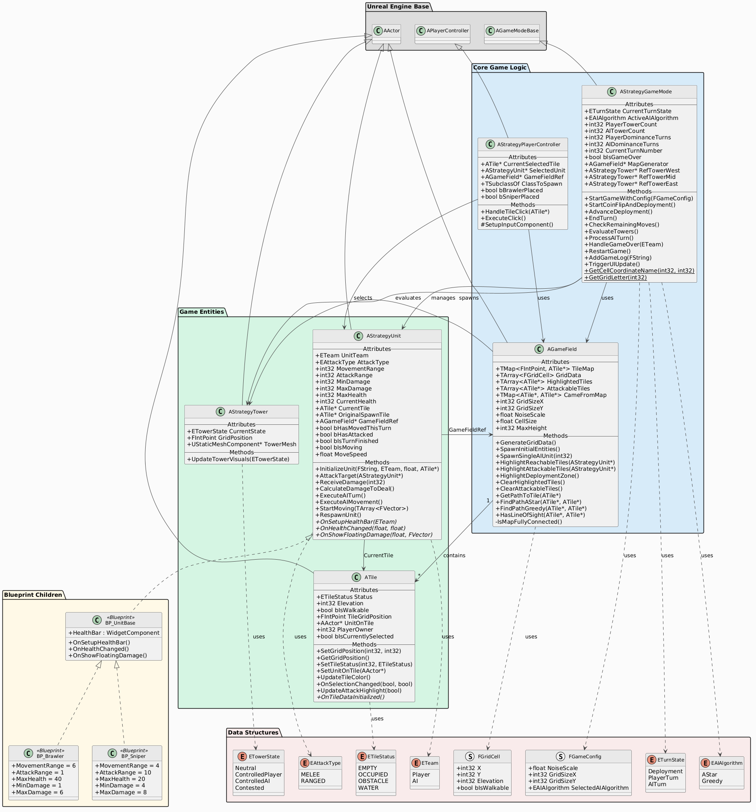

# Knightmare 
## Strategico a Turni — Unreal Engine 5.6

> Progetto universitario per il corso PAA — Gioco strategico a turni 1vs1 (Giocatore vs IA)

---

## Descrizione (IT)

Questo progetto consiste in un videogioco **strategico a turni 1vs1** (Giocatore vs IA) sviluppato in **Unreal Engine 5.6** per il corso PAA. Il gioco si svolge su una griglia procedurale **25×25** generata tramite l'algoritmo **Perlin Noise**, con **5 livelli di elevazione** che influenzano il movimento e il combattimento.

### Caratteristiche Principali

- **Mappa Procedurale** 
  Ogni partita presenta una conformazione del terreno diversa grazie all'uso di seed casuali.
- **Classi di Unità** 
  Sniper (attacco a distanza) e Brawler (combattimento corpo a corpo).
- **Sistema di Conquista** 
  Tre torri posizionate simmetricamente fungono da obiettivi strategici per la vittoria.
- **Intelligenza Artificiale**
  Implementazione di algoritmi di ricerca del percorso A\* e Greedy Best-First Search.
- **Sviluppo C++** 
  Il core del gioco è interamente scritto in C++, utilizzando i Blueprint solo per l'interfaccia grafica (UMG).

---

## Description (EN)

This project is a **1vs1 strategic turn-based game** (Player vs AI) developed using **Unreal Engine 5.6** for the PAA course. The gameplay takes place on a **25×25 procedural grid** generated via **Perlin Noise**, featuring **5 elevation levels** that impact both movement and combat mechanics.

### Key Features

- **Procedural Mapping** — Every match features a unique terrain layout driven by random seeds.
- **Unit Classes** — Sniper (long-range specialist) and Brawler (close-quarters combatant).
- **Objective-Based Gameplay** — Three symmetrically placed towers serve as the primary strategic win condition.
- **Artificial Intelligence** — Pathfinding and decision-making powered by A\* and Greedy Best-First Search algorithms.
- **C++ Core** — The game logic is strictly implemented in C++, with Blueprints used exclusively for UI (UMG).

---

## Stato dei Requisiti / Requirement Status

| # | Requisito / Requirement | Stato / Status |
|---|-------------------------|:--------------:|
| 1 | Codice strutturato, commentato e compilazione corretta | Done|
| 2 | Griglia di gioco iniziale visibile e corretta | Done |
| 3 | Meccanismo di posizionamento Unità e Torri | Done |
| 4 | Intelligenza Artificiale basata su algoritmo A\* | Done |
| 5 | Gestione Turni e Condizione di Vittoria | Done |
| 6 | Interfaccia grafica (Turno, HP, Torri conquistate) | Done |
| 7 | Suggerimento range di movimento (Highlight celle) | Done |
| 8 | Meccanismo di danno da contrattacco | Done |
| 9 | Storico delle mosse (Combat Log) | Done |
| 10 | Algoritmo IA euristico ottimizzato (Greedy Best-First) | Done |

---

## Diagramma UML



---

## Tecnologie Utilizzate / Technologies Used

| Componente | Tecnologia |
|------------|------------|
| Engine | Unreal Engine 5.6 |
| Language | C++ |
| UI | UMG (Unreal Motion Graphics) |
| Algorithms | Perlin Noise, A\*, Dijkstra, Greedy Best-First Search, Bresenham's Line Algorithm |

---

## Installazione / Installation

1. **Clonare la repository / Clone the repository**
```bash
   git clone https://github.com/simocastro18/Knightmare
```

2. **Fare clic destro sul file `.uproject`** e selezionare **"Generate Visual Studio project files"**

3. **Aprire il file `.sln`** e compilare il progetto in modalità **"Development Editor"**

4. **Avviare l'editor di Unreal** ed eseguire la mappa principale